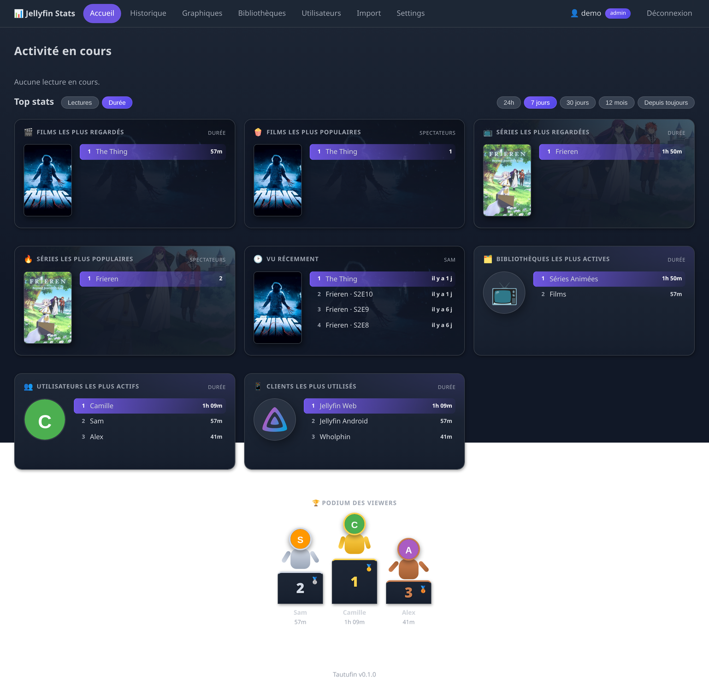
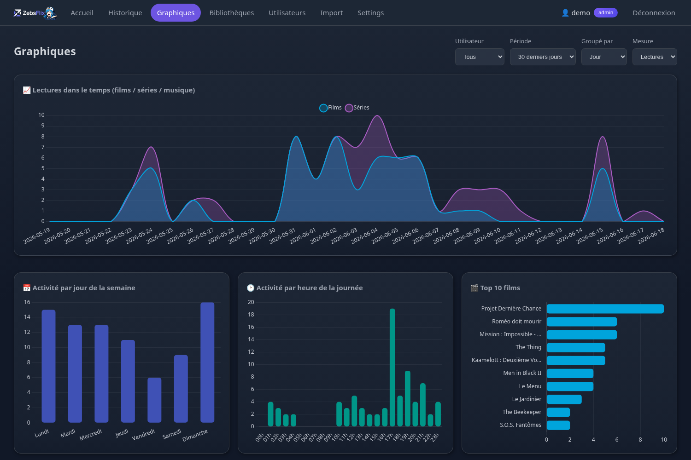
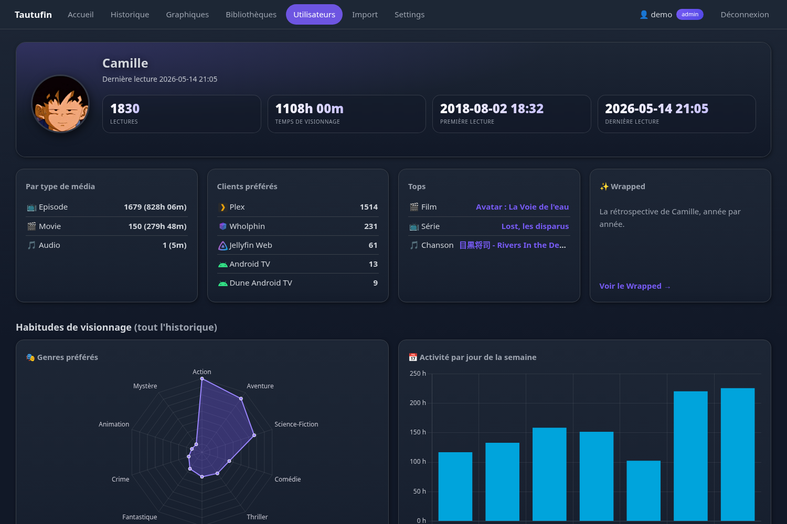
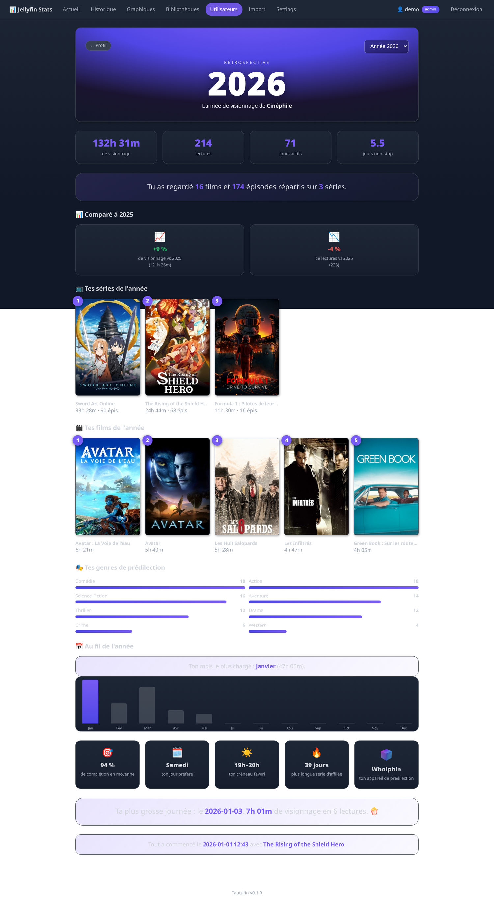
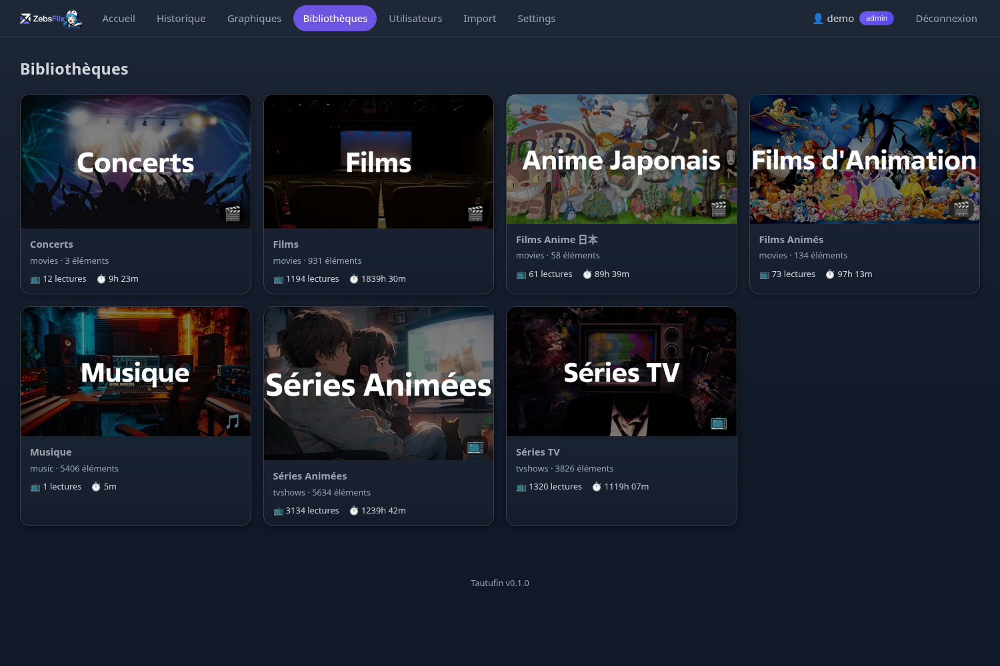
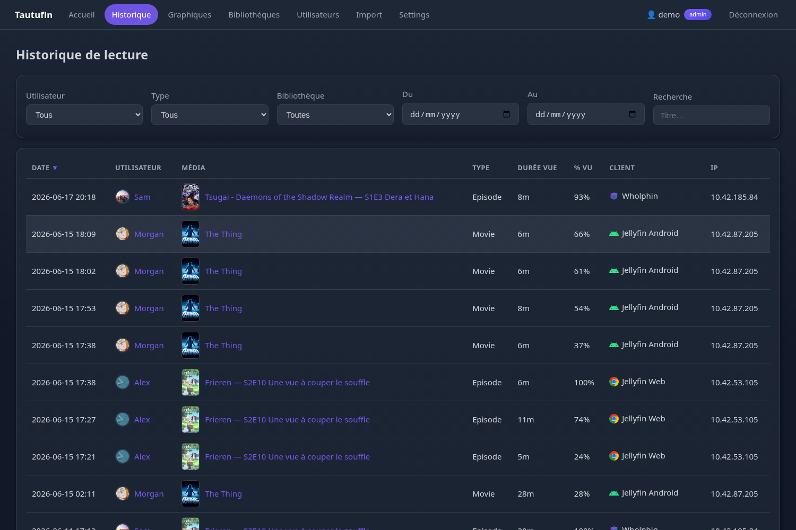
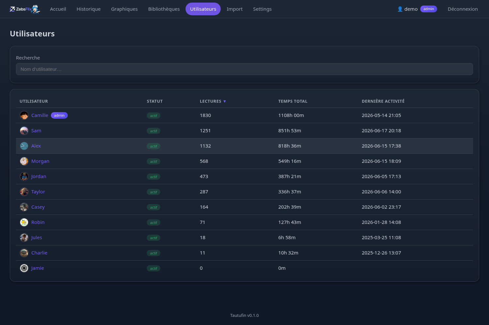
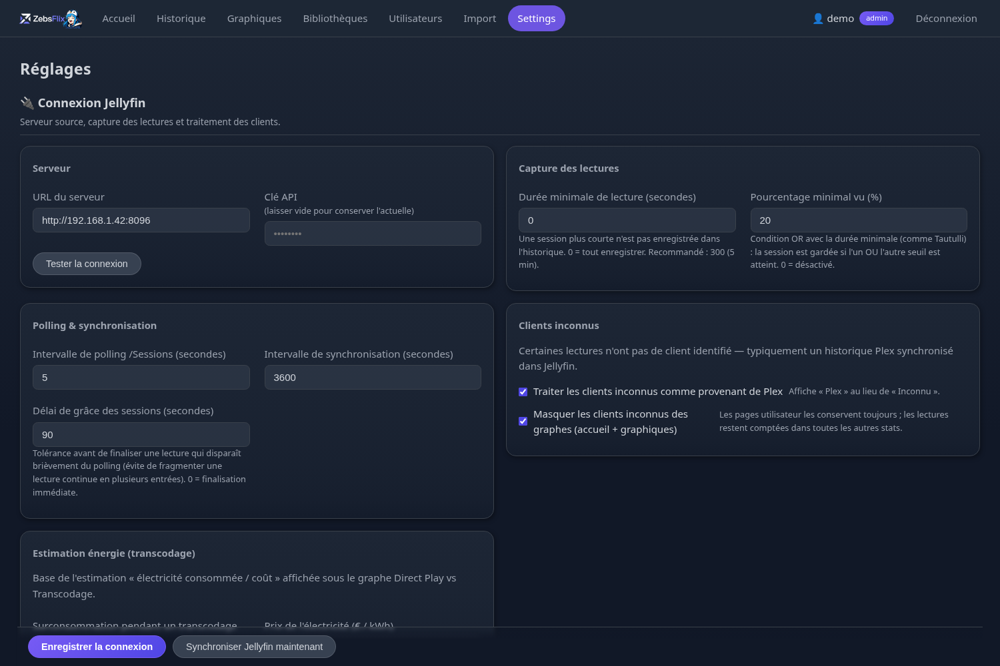

# Tautufin

**Tableau de bord de statistiques et d'historique de lecture pour [Jellyfin](https://jellyfin.org/)** —
l'équivalent de [Tautulli](https://github.com/Tautulli/Tautulli) (Plex), construit sur l'API REST de Jellyfin.

Tautufin se branche sur votre serveur Jellyfin, capture l'activité de lecture en
continu, et la restitue sous forme de graphiques, de classements, de profils par
utilisateur et d'une rétrospective annuelle « Wrapped ». Thème sombre, multi-
utilisateurs, auto-hébergé.



> Les captures de ce README utilisent des **noms d'utilisateurs anonymisés**.

---

## Sommaire

- [Fonctionnalités](#fonctionnalités)
- [Installation](#installation)
- [Premier lancement](#premier-lancement)
- [Visite guidée](#visite-guidée)
- [Authentification & permissions](#authentification--permissions)
- [Import d'un historique existant](#import-dun-historique-existant)
- [Maintenance](#maintenance)
- [Configuration](#configuration-configini)
- [Architecture](#architecture)

---

## Fonctionnalités

- 📊 **Graphiques riches** (Chart.js) : lectures dans le temps, films / séries /
  musique, top utilisateurs, genres, acteurs, réalisateurs, résolutions, clients,
  Direct Play vs transcodage…
- 📜 **Historique** filtrable (utilisateur, type, bibliothèque, période),
  recherchable, triable et paginé — avec poster et logo du client
- 👤 **Profils par utilisateur** : KPIs, clients préférés, top film/série/chanson
  (par temps de visionnage), habitudes (jour, heure), lectures récentes
- ✨ **Wrapped** : rétrospective annuelle par utilisateur (tops, genres,
  saisonnalité, plus longue série de jours, comparaison N-1, % de complétion…)
- 🗂️ **Bibliothèques** : vue d'ensemble avec l'image de la médiathèque, et
  catalogue recherchable des films / séries
- 👥 **Multi-utilisateurs** : chacun voit ses propres stats ; les admins (et les
  comptes dotés du droit *vision*) voient la vue globale
- 🔐 **Gestion fine des utilisateurs** : masquer des stats, bloquer l'accès,
  accorder le droit *vision*
- 📦 **Import** de l'historique existant : plugin
  [Playback Reporting](https://github.com/jellyfin/jellyfin-plugin-playbackreporting)
  **et** backup [Streamystats](https://github.com/fredrikburmester/streamystats)
  (idempotent)
- ⚡ **Estimation de conso** : électricité et coût imputables au transcodage
- 🛠️ **Maintenance** intégrée : sauvegarde, vérification et réinitialisation de
  la base
- 🖼️ Posters et avatars servis via un **proxy côté serveur** avec cache — la clé
  API Jellyfin n'est jamais exposée au navigateur
- 🎨 Thème sombre responsive ; logo et favicon personnalisables

---

## Installation

### Docker avec l'image GitHub Container Registry (recommandé)

Le fichier `docker-compose.yml` utilise l'image publiée sur GitHub Container
Registry : `ghcr.io/zebs64/tautufin:latest`.

```bash
mkdir -p config          # important : sinon Docker crée le dossier en root
docker compose pull
docker compose up -d
```

L'application écoute sur `http://localhost:8181`. La configuration et la base
SQLite sont persistées dans `./config/`.

Le `docker-compose.yml` fixe le fuseau horaire via `TZ=Europe/Paris` — **adaptez-le
à votre fuseau**. Il sert de référence pour l'horodatage du monitoring et la
conversion des imports (voir [Import](#import-dun-historique-existant)).

<details>
<summary>Exemple <code>docker-compose.yml</code> avec image publiée</summary>

```yaml
services:
  tautufin:
    image: ghcr.io/zebs64/tautufin:latest
    container_name: tautufin
    restart: unless-stopped
    environment:
      - TZ=Europe/Paris
    ports:
      - "8181:8181"
    volumes:
      - ./config:/config
      # Optionnel : monter le dossier data de Jellyfin (lecture seule) pour
      # importer playback_reporting.db directement depuis la page Import.
      # - /var/lib/jellyfin/data:/jellyfin-data:ro
```
</details>

### Docker avec build local

Pour construire l'image depuis les sources au lieu d'utiliser GHCR :

```bash
mkdir -p config
docker compose -f docker-compose.build.yml build
docker compose -f docker-compose.build.yml up -d
```

Le fichier `docker-compose.build.yml` est identique au compose standard, mais
remplace l'image publiée par `build: .`.

### Manuelle

Prérequis : Python ≥ 3.10.

```bash
python -m venv .venv
source .venv/bin/activate
pip install -r requirements.txt
python main.py            # options : --config <chemin> --host --port --debug
```

---

## Premier lancement

Au premier accès, un **assistant de configuration** s'affiche :

1. **URL du serveur Jellyfin** + **clé API** (à générer dans Jellyfin :
   *Tableau de bord → Avancé → Clés API*). Optionnel à cette étape — configurable
   ensuite dans *Réglages*.
2. **Compte admin local de secours** (obligatoire) : utilisable même si Jellyfin
   est injoignable.

Une première synchronisation (utilisateurs, bibliothèques, médias) démarre alors
en arrière-plan, puis se répète périodiquement.

---

## Visite guidée

### Accueil

Activité en cours (sessions en lecture), puis « Top stats » sur la période
choisie (24 h → depuis toujours) : films/séries les plus regardés et populaires,
vu récemment, bibliothèques et utilisateurs les plus actifs, podium des viewers.


### Graphiques

Une grille de graphiques filtrables par **période**, **utilisateur** et
**mesure** (nombre de lectures ou durée). Sous *Direct Play vs Transcodage*, une
**estimation de l'électricité consommée et du coût** du transcodage sur la
période (base configurable dans les Réglages).



### Profil utilisateur

Indicateurs clés, répartition par type, clients préférés, **top film / série /
chanson** (classés par temps de visionnage), habitudes de visionnage (genres,
jour de la semaine, heure de la journée en heures), et lectures récentes avec
posters cliquables et logo du client.



### Wrapped

Une rétrospective annuelle façon « Spotify Wrapped », par utilisateur et par
année : temps total, tops films/séries en posters, genres, saisonnalité, jour et
créneau favoris, plus longue série de jours consécutifs, **comparaison avec
l'année précédente** et **% de complétion moyen**.



### Bibliothèques

Vue d'ensemble en cartes (avec l'image de chaque médiathèque), puis détail d'une
bibliothèque : répartitions, tops, et **catalogue recherchable** des films/séries
en posters.



### Historique

Tableau filtrable (utilisateur, type, bibliothèque, dates, recherche), triable et
paginé. Poster du média (poster de la **série** pour un épisode), logo du client,
et — pour les admins — l'adresse IP.



### Utilisateurs

Liste des utilisateurs Jellyfin avec **recherche** et **tri** (nom, lectures,
temps total, dernière activité). Chaque ligne mène au profil correspondant.



### Réglages

Organisés en sections : **Connexion Jellyfin** (serveur, capture, polling,
clients inconnus, base de l'estimation énergie), **Apparence**, **Accès &
utilisateurs**, et **Maintenance**.



---

## Authentification & permissions

### Deux modes de connexion

- **Compte Jellyfin** *(recommandé)* — identifiants vérifiés via
  `POST /Users/AuthenticateByName`. Les admins Jellyfin deviennent
  automatiquement admins de Tautufin. **Le token Jellyfin n'est jamais
  persisté** : seuls l'UserId, le nom et le rôle vivent dans la session serveur.
- **Compte local** — créé par un admin dans les Réglages (stockage bcrypt). Peut
  être *lié* à un utilisateur Jellyfin (il consulte alors ses stats) ou rester
  non lié (admin technique, compte de secours).

Reset d'un mot de passe local (CLI) : `python main.py --reset-password <username>`.

### Rôles & droits

| Capacité                                   | Admin | Vision | Utilisateur |
|--------------------------------------------|:-----:|:------:|:-----------:|
| Voir ses propres stats & historique        |  ✓    |  ✓     |  ✓          |
| Voir les stats de **tous** les utilisateurs|  ✓    |  ✓     |  ✗          |
| Voir les adresses IP                       |  ✓    |  ✗     |  ✗          |
| Accéder aux Réglages / Import              |  ✓    |  ✗     |  ✗          |

Depuis les Réglages, chaque utilisateur Jellyfin peut être :

- **Masqué** — totalement exclu des statistiques globales (son propre profil
  reste accessible) ;
- **Accès bloqué** — connexion à Tautufin refusée (effet immédiat, déconnecte les
  sessions en cours) ;
- doté du droit **Vision** — voit les stats de tout le monde comme un admin, mais
  **sans** accès à la configuration ni à l'import.

Le filtrage par utilisateur est imposé **côté serveur** depuis la session (jamais
depuis un paramètre client) ; les routes admin répondent en **HTTP 403**. Le login
est limité à 5 tentatives / minute / IP.

---

## Import d'un historique existant

Page *Import* (admin). Deux origines sont reconnues automatiquement au contenu :

- **Playback Reporting** : base SQLite du plugin (`playback_reporting.db`) ou
  backup `PlaybackReportingBackup-*.tsv` ;
- **Streamystats** : fichier de backup JSON (`sessions`).

Workflow : *Analyser* (nombre d'entrées, plage de dates, utilisateurs) puis
*Importer* (résolution des noms via `/Users`, enrichissement genres/durée/
bibliothèque depuis le cache de médias, application des seuils de durée minimale).

L'import est **idempotent** — clé de déduplication `(utilisateur, média, date de
début)`, index SQL unique.

> **Fuseau horaire.** Les backups Streamystats horodatent en **UTC** ; Playback
> Reporting et le monitoring en **heure locale**. Tautufin convertit les
> timestamps UTC vers le fuseau défini par la variable `TZ` (défaut `Europe/Paris`)
> à l'import, pour éviter les doublons décalés d'1–2 h entre deux sources. Veillez
> donc à régler `TZ` sur le fuseau de votre serveur Jellyfin.

---

## Maintenance

Section *Réglages → Maintenance* (admin) :

- **Sauvegarde** — télécharge un instantané cohérent de la base au format SQLite
  (snapshot via l'API backup, compatible WAL) ;
- **Vérification** — `PRAGMA integrity_check` + clés étrangères, avec compteurs et
  taille de la base ;
- **Réinitialisation** ⚠️ — vide l'historique et les caches (médias,
  bibliothèques, utilisateurs Jellyfin). **Les comptes locaux et votre session
  sont conservés** ; les données Jellyfin sont repeuplées à la synchro suivante.
  Action irréversible — exportez un backup d'abord.

---

## Configuration (`config.ini`)

Persisté dans `./config/config.ini` (généré au premier lancement). Principales
sections :

| Section        | Clés notables |
|----------------|---------------|
| `[Jellyfin]`   | `url`, `api_key`, `verify_ssl` |
| `[Auth]`       | `session_lifetime` (défaut 7 j), `jellyfin_auth_enabled`, `local_auth_enabled`, `secret_key` (auto-généré) |
| `[Monitoring]` | `minimum_duration` (s), `minimum_percent` (% — **condition OR** avec la durée, comme Tautulli), `poll_interval`, `sync_interval`, `session_grace` |
| `[Clients]`    | `unknown_as_plex`, `hide_unknown_clients` (lectures importées sans client identifié — ex. historique Plex) |
| `[Energy]`     | `transcode_watts`, `electricity_price` (base de l'estimation de conso transcodage) |
| `[UI]`         | `allow_user_library_pages` |
| `[Web]` / `[Database]` | écoute HTTP, chemin SQLite |

La plupart de ces réglages sont éditables depuis la page *Réglages*.

---

## Architecture

```
jellyfin_stats/
├── main.py              # point d'entrée, CLI, routes FastAPI
├── config.py            # config.ini (défauts, secret auto-généré)
├── database.py          # SQLite + migrations versionnées + maintenance
├── auth.py              # logins Jellyfin/local, sessions serveur, rate limit
├── jellyfin_api.py      # wrapper API Jellyfin
├── activity.py          # suivi des sessions + seuils de durée minimale
├── history.py           # historique (filtres, tri, pagination)
├── graphs.py            # agrégations pour Chart.js
├── users.py             # profils & gestion des utilisateurs
├── libraries.py         # bibliothèques & catalogue
├── wrapped.py           # rétrospective annuelle
├── import_playback.py   # import Playback Reporting (+ normalisation TZ)
├── import_streamystats.py
└── scheduler.py         # polling /Sessions, sync périodique, purge sessions
data/interfaces/default/ # templates Jinja2 + static (thème sombre)
```

Stack : **FastAPI** + **SQLite** (migrations ordonnées appliquées au démarrage) +
**Jinja2** + **Chart.js**. Les sessions HTTP vivent côté serveur ; le cookie ne
contient qu'un token signé (`itsdangerous`), `HttpOnly` + `SameSite=Lax`.

### Endpoints Jellyfin utilisés

| Endpoint                          | Usage                              |
|-----------------------------------|------------------------------------|
| `POST /Users/AuthenticateByName`  | Login des utilisateurs Jellyfin    |
| `GET /System/Info`                | Test de connexion                  |
| `GET /Users`                      | Synchronisation des utilisateurs   |
| `GET /Sessions`                   | Activité en cours (polling)        |
| `GET /Library/VirtualFolders`     | Bibliothèques                      |
| `GET /Items`                      | Médias (genres, codecs, durées)    |
| `GET /Items/{id}/Images/*`        | Posters & avatars (proxy + cache)  |
